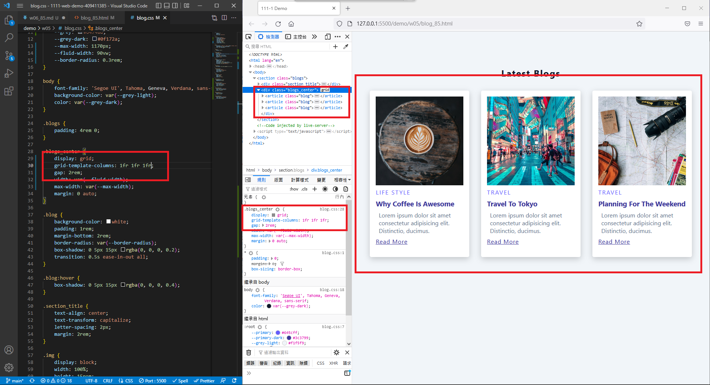
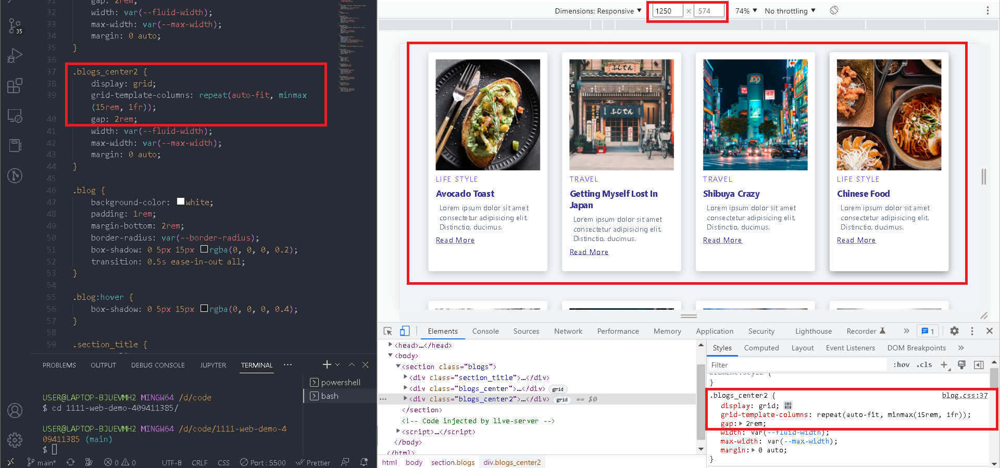
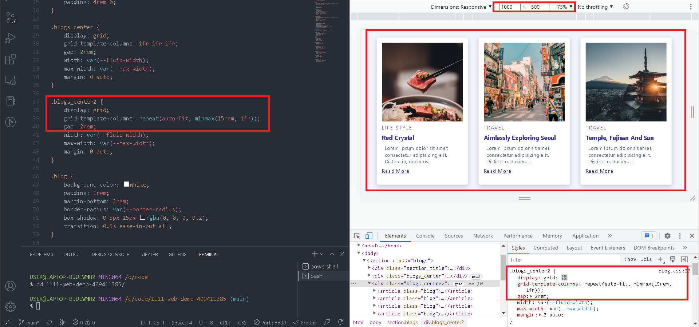
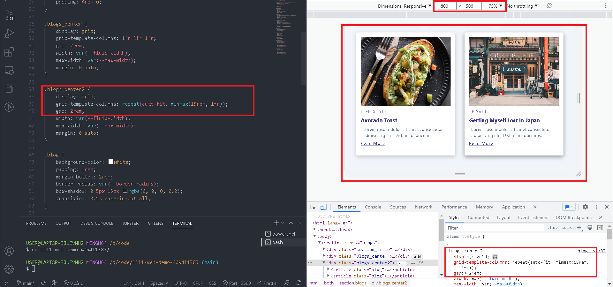
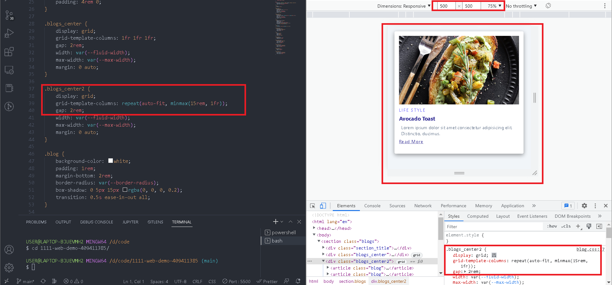
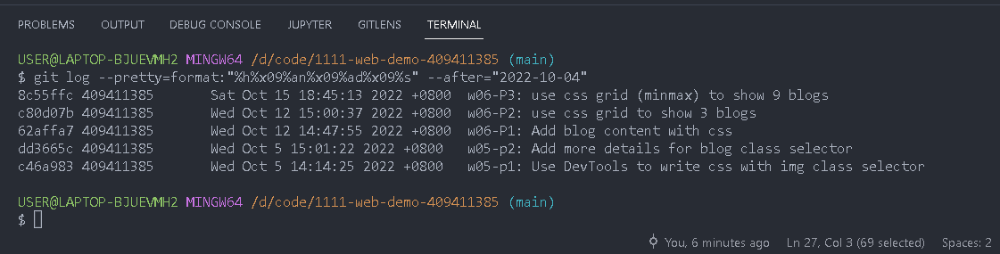

### github & vercel url

[github url](https://github.com/409411385/1111-web-demo-409411385)

[vercel url](https://1111-web-demo-409411385-tyqf.vercel.app/)

### w06-P1: Add blog content with css


### w06-P2: use css grid to show 3 blogs



### w06-P3: use css grid (minmax) to show 9 blogs






### W06-logs: W6 all logs



```
$ git log --pretty=format:"%h%x09%an%x09%ad%x09%s" --after="2022-10-04"

8c55ffc 409411385       Sat Oct 15 18:45:13 2022 +0800  w06-P3: use css grid (minmax) to show 9 blogs
c80d07b 409411385       Wed Oct 12 15:00:37 2022 +0800  w06-P2: use css grid to show 3 blogs
62affa7 409411385       Wed Oct 12 14:47:55 2022 +0800  w06-P1: Add blog content with css
dd3665c 409411385       Wed Oct 5 15:01:22 2022 +0800   w05-p2: Add more details for blog class selector
c46a983 409411385       Wed Oct 5 14:14:25 2022 +0800   w05-p1: Use DevTools to write css with img class selector
```