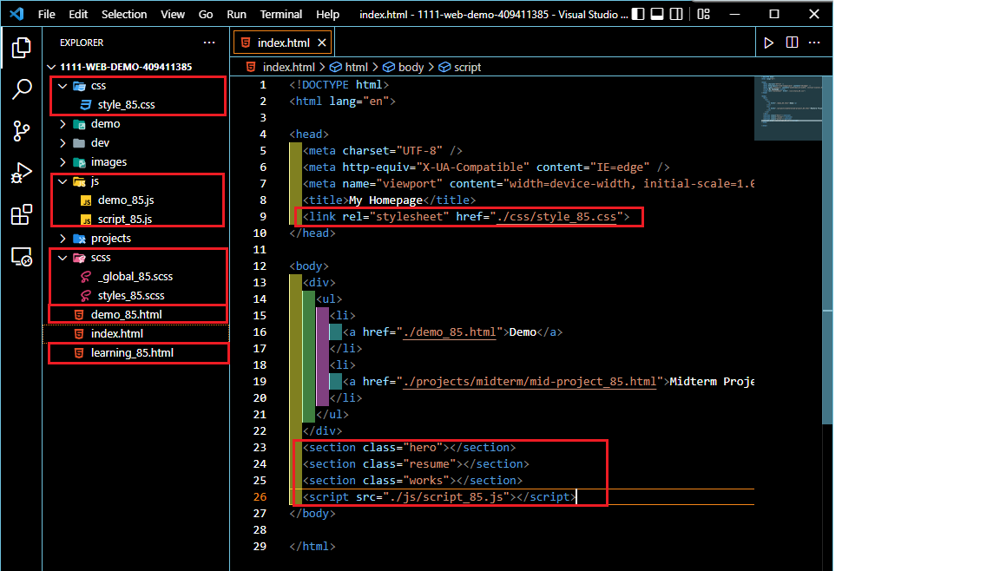
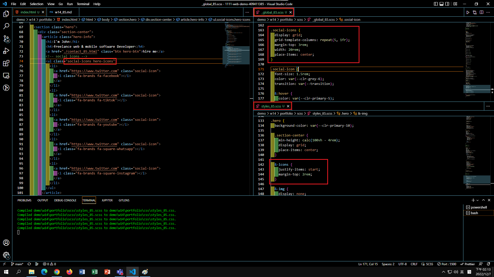

### github & vercel url

[github url](https://github.com/409411385/1111-web-demo-409411385)

[vercel url](https://1111-web-demo-409411385-tyqf.vercel.app/)

### w14-P1: file structures for final project



### w14-P2: social icons using global css, and custom css



### w14-P3: Services section with responsive design with phone, pad and desktop computer


### w14-P4: finish About section with responsive design with phone, and desktop computer


```
$ git log --pretty=format:"%h%x09%an%x09%ad%x09%s" --after="2022-12-06"
6908954 409411385       Sun Dec 11 23:32:21 2022 +0800  w14-P4: finish About section with responsive design with phone, and desktop computer
6dcf370 409411385       Sun Dec 11 23:30:57 2022 +0800  w14-P3: Services section with responsive design with phone, pad and desktop computer
547bee7 409411385       Wed Dec 7 14:17:10 2022 +0800   w14-P2: social icons using global css, and custom css
e1035ef 409411385       Wed Dec 7 13:39:05 2022 +0800   w14-P1: file structures for final project
```

